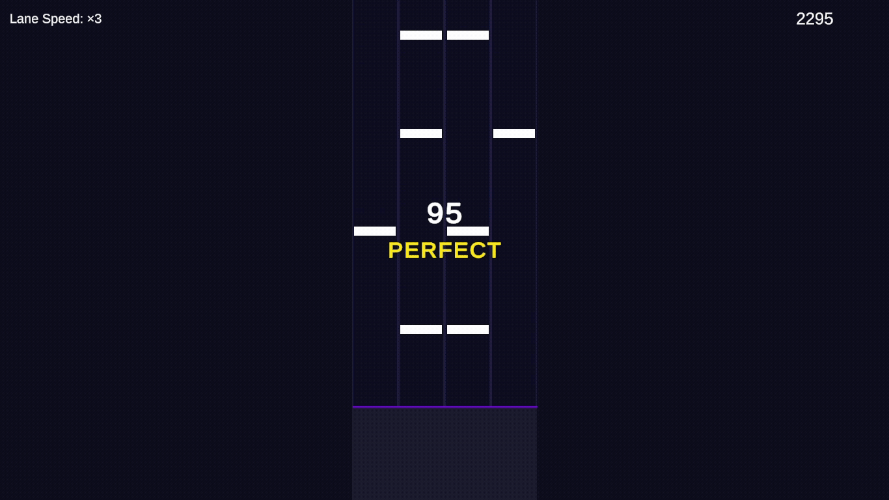

# Rain
> Rain은 Unity + C# 기반 4레인 탑다운 리듬게임 프로젝트입니다.

---

## 프로젝트 개요

- **개발 환경** : Unity 6 (6000.x), C#

노트가 위에서 아래로 떨어지는 고전적인 탑다운 방식의 4키 리듬게임입니다.  
D / F / J / K 키로 4개의 레인을 담당하며, CSV 형식의 보면 파일을 읽어 노트를 출력합니다.

---

## 실행 환경

| 항목 | 권장 사양 |
|------|---------|
| 해상도 | 1920 × 1080 (Full HD) |
| OS | Windows 10 이상 |

> UI가 1920×1080 해상도에 최적화되어 있습니다.  
> 다른 해상도에서는 UI가 올바르게 표시되지 않을 수 있습니다.

---



## 조작법

| 키 | 기능 |
|----|------|
| D / F / J / K | 레인 1 / 2 / 3 / 4 입력 |
| ↑ / ↓ | 선곡 화면 곡 선택 |
| ← / → | 난이도 선택 (Easy / Normal / Hard) |
| 3 / 9 | 배속 감소 / 증가 (×0.5 ~ ×5.0) |
| Enter | 확인 / 시작 |
| ESC | 일시정지 |

---

## 구현 기능

### 씬 구성
- **TitleScene** : BGM 재생, Enter 키로 선곡 화면 이동
- **SelectScene** : 곡 선택 / 난이도 선택 / 배속 조정
- **PlayScene** : 노트 낙하, 판정, 점수/콤보 집계, 일시정지 메뉴
- **ResultScene** : 판정 통계, 점수, 랭크 표시

### 핵심 시스템

**dspTime 기반 정밀 판정**
```
AudioSettings.dspTime(오디오 DSP 스레드 시계)을 기준으로 판정을 계산합니다.
키 입력 콜백 발생 시점의 dspTime을 즉시 기록하여
프레임레이트 변동에 의한 판정 오차를 최소화합니다.
```

**New Input System 기반 입력 처리**
```
Unity New Input System의 콜백 방식을 사용합니다.
레거시 방식(Update + GetKeyDown)은
최대 1프레임(약 16ms)의 입력 감지 오차가 발생할 수 있으나
콜백 방식은 입력 발생 시점을 정확하게 포착합니다.
```

**CSV 기반 채보 시스템**
```
time,lane,isLong,longDuration 형식의 CSV 파일을 파싱하여 노트 데이터를 로드합니다.
채보 파일 없이도 더미 데이터로 동작하도록 폴백(fallback) 처리가 적용되어 있습니다.
```

**롱노트 지원**
```
CSV 파일의 isLong,longDuration 데이터를 기반으로 롱노트 여부와 길이를 입력받습니다.
시작점(Head) 판정과 별도로 조기 릴리즈하는 경우 롱노트 오브젝트의 색상을 변경하고 Miss 처리합니다.
```

### 판정 시스템

| 판정 | 오차 범위 | 점수 |
|------|---------|------|
| PERFECT | ±40ms | 2점 |
| GREAT | ±80ms | 1점 |
| GOOD | ±120ms | 0점 |
| MISS | 120ms 초과 | 0점, 콤보 초기화 |

### 랭크 기준

| 랭크 | 조건 |
|------|------|
| S | 달성 점수 / 만점 × 100 ≥ 95% |
| A | 90% 이상 |
| B | 80% 이상 |
| C | 70% 이상 |
| D | 70% 미만 |

---

## 채보 CSV 형식

```csv
time,lane,isLong,longDuration
1.000,1,0,0
1.500,4,0,0
2.000,2,1,0.500
```

| 컬럼 | 설명 |
|------|------|
| time | 판정선 도착 시각 (초, 음악 시작 = 0) |
| lane | 레인 번호 (1=D, 2=F, 3=J, 4=K) |
| isLong | 롱노트 여부 (0=일반, 1=롱노트) |
| longDuration | 롱노트 지속 시간 (초) |

---

## 향후 개선 예정

- ~~롱노트 구현~~완료
- 입력 지연 보정 (오프셋 설정)
- 채보 에디터

---

## 사용 음원

게임 실행을 위해서는 아래 음원 파일을 직접 다운로드한 후
Assets/Resources/Audio/ 경로에 배치해야 합니다.

| 파일명 | 곡명 | 아티스트 | 용도 | 출처 |
|--------|------|---------|------|------|
| Sunrise.mp3 | Sunrise (feat. fawlin) | Tatsunoshin, fawlin | 타이틀 BGM / 플레이 곡 1 | https://ncs.io/TS_sunrise |
| FlyHigh.mp3 | Fly High | KDH, Tatsunoshin | 플레이 곡 2 | https://ncs.io/flyhigh |
| All Or Nothing.mp3 | All Or Nothing | No Hero, Tatsunoshin | 플레이 곡 3 | https://ncs.io/TN_AllOrNothing |

Music provided by NoCopyrightSounds (https://ncs.io)

---

## 개발자

**김진성 (KIMJINSUNG-dev)**